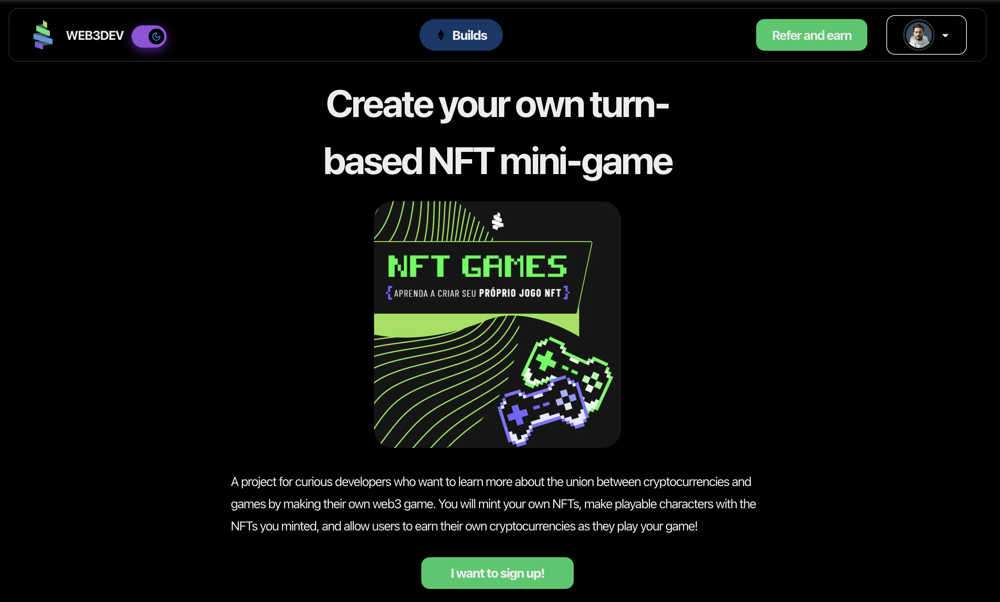
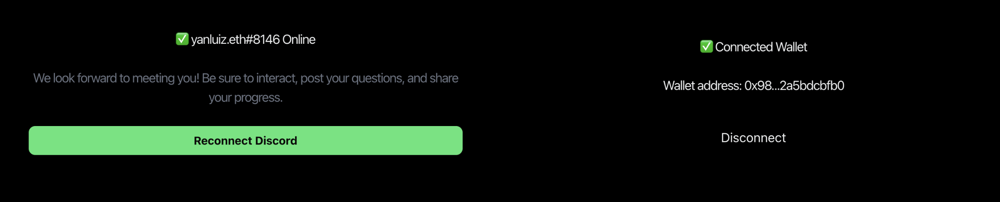
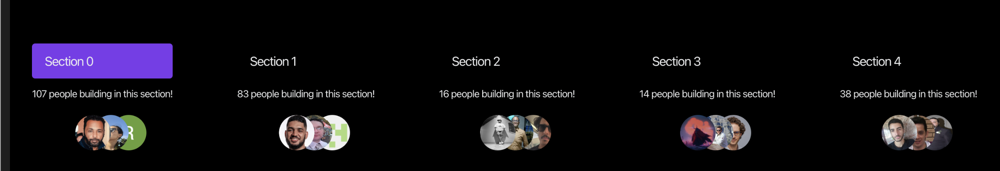
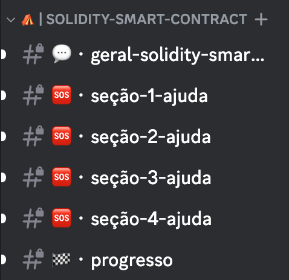
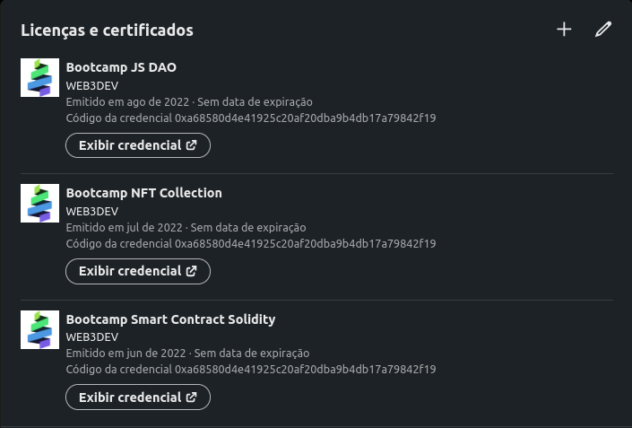
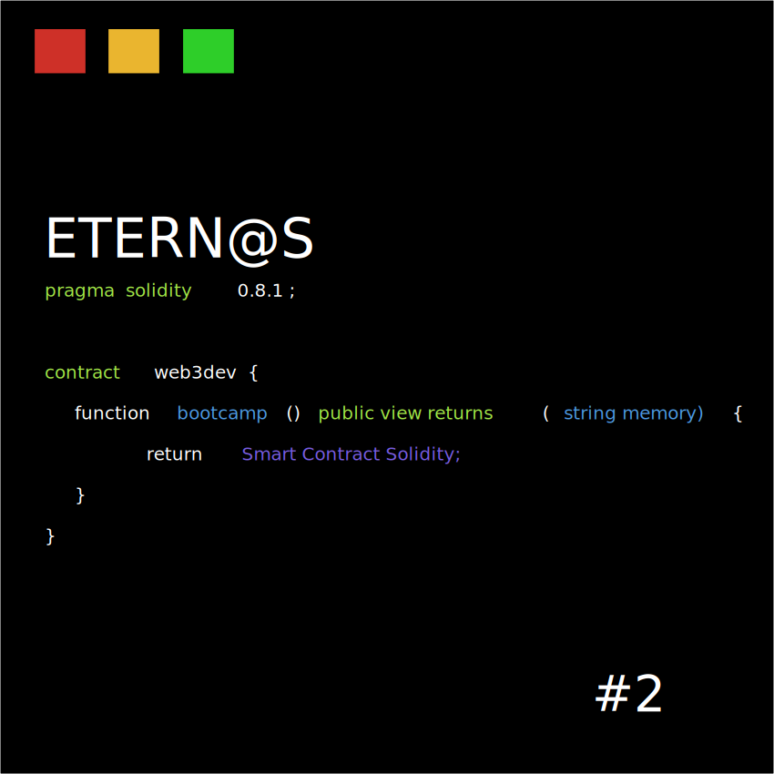

# Table of Contents

- [Course Platform Overview](#course-platform-overview)
  - [Access and Navigation](#access-and-navigation)
  - [Enrollment and Experience](#enrollment-and-experience)
  - [Course Structure](#course-structure)
  - [Discord Support](#discord-support)
  - [Features and Offerings](#features-and-offerings)
  - [Cohorts and Certification](#cohorts-and-certification)
    - [NFT Certificates](#nft-certificates)
    - [Key Features of the NFT Certificates](#key-features-of-the-nft-certificates)
  - [Multi-Language Support and Open-Source Content](#multi-language-support-and-open-source-content)
- [How To Contribute](#how-to-contribute)
  - [Requirements](#requirements)
  - [Environment](#environment)
  - [Loading Firebase Contents on Your Project](#loading-firebase-contents-on-your-project)
  - [Getting Started](#getting-started)

# Course Platform Overview

Our practical learning platform, located at [build.w3d.community](http://build.w3d.community/), offers courses focused on blockchain and web3 technologies. Here’s a quick guide to get you started:

## Access and Navigation

- **Homepage**: The starting point showcasing our latest or current course.
  
  

- **All Courses**: For a detailed list of all available courses, visit our course catalog at [build.w3d.community/courses](https://build.w3d.community/courses).

## Enrollment and Experience

- To participate in courses, users must sign in using a Google account or GitHub.
- For a comprehensive experience, connect your MetaMask/Ethereum wallet and Discord account. This allows for receiving NFT Certificates and accessing support channels.

  

## Course Structure

Courses are organized into five key sections. Each section contains lessons with a specific area where students can enter their code. This setup is aimed at helping students fully understand the topics covered.



## Discord Support

Our Discord community mirrors the course structure, offering dedicated channels for each of the 5 sections, along with channels for sharing progress and obtaining general support.



## Features and Offerings

- **NFT Certificates**: On course completion, participants receive an non-transferable NFT, viewable in our [OpenSea Collection](https://opensea.io/collection/web3dev-bootcamp).
- **Mentorship**: Graduates can become mentors, helping new students through their learning journey.

## Cohorts and Certification

- We offer both "Eternal" cohorts for asynchronous learning and event-based cohorts with live coding sessions.
- Courses typically last 10 days. Timely completion awards a cohort-specific NFT, while later completion grants an "Eternal" NFT for the course.

### NFT Certificates
Upon completing our courses, students are awarded unique NFT certificates. These digital certificates serve as a modern testament to your achievement and can be prominently displayed on professional networks like LinkedIn.



### Key Features of the NFT Certificates:

* Limited Traits: Each NFT certificate contains only three specific traits: the course name, the cohort, and the student's completion number. This tailored approach highlights the personalized journey of each learner.

* Dynamic SVG on Blockchain: The certificate is a dynamic SVG file stored directly on the blockchain. This innovative format allows for the certificate to evolve; new courses can be added simply by updating the aforementioned fields.



In the sample above, "ETERNOS" denotes the cohort, and the course title, in this instance, "SoliditySmartContract", is dynamically generated. This ensures that each certificate is not only a symbol of personal accomplishment but also a piece of art tailored to the individual's learning path.

## Multi-Language Support and Open-Source Content

Our platform is inclusive, supporting multi-language content to cater to a global audience. All course materials are open-source, accessible through markdown files in the `web3dev-version` branch of our [GitHub repository](https://github.com/w3b3d3v/buildspace-projects/tree/web3dev-version).

# How To Contribute

### Requirements

- Node.js 14 and yarn
- Firebase [Authentication](https://firebase.google.com/docs/auth) and [Firestore](https://firebase.google.com/docs/firestore)

### Environment 
- Copy the contents in `.env.example` to `.env` 
- Set the Firebase and the Discord variables. You can find discord variables [here](https://discord.com/developers/applications). Create an application if you don't have one. 
- Set all the other necessary variables. 

### Loading Firebase contents on your project

You must have an active google cloud account. Maybe you will have to activate the billing to make it work.
- Install [gsutil](https://cloud.google.com/storage/docs/gsutil)
- Install [gcloud](https://cloud.google.com/sdk/gcloud)
- run `gcloud config set project <YOUR_FIREBASE_PROJECT>`
FIREBASE_PROJECT is the name of the project you created on firebase. For example, for me, it is `web3dev-development`.

The script bellow will restore a sample database for Firestore, so you can have some data to work with. 
Run it passing your Google Cloud Bucket as an argument. [Reference](https://cloud.google.com/storage/docs/creating-buckets)
- run `./load_db.sh YOUR_GCLOUD_BUCKET`

If you want only a local database (it will not interact with many things in the platform), you can simply unzip `bkp` folder in local and start firebase emulators importing bkp:
`firebase emulators:start --import bkp --export-on-exit bkp`

### Getting started

Run the following command on your local environment:

```
git clone https://github.com/w3b3d3v/web3-bootcamp-platform.git web3-bootcamp-plataform
cd web3-bootcamp-plataform
yarn install
```

Then, you can run locally in development mode with live reload:

```
yarn run dev
```

Open http://localhost:3000 with your favorite browser to see your project.

```
.
├── README.md                # README file
├── next.config.js           # Next JS configuration
├── public                   # Public folder
│   └── assets
│       └── img              # Image used by default template
├── components               # Atomic layout components
├── context                  # Context 
├── firebase                 # Firebase configuration
├── functions                # Cloud functions
├── hooks                    # Hooks
├── lib                      # Content library
├── pages                    # Next JS pages
├── styles                   # PostCSS style folder with Tailwind
├── scripts                  # Task-specific scripts
├── .env.example             #  ENV example file
├── tailwind.config.js       # Tailwind CSS configuration
└── tsconfig.json            # TypeScript configuration
└── tsconfig.json            # TypeScript configuration
```


### Deploy to production

You can see the results locally in production mode with:

```
$ yarn build
$ yarn start
```

The generated HTML and CSS files are minified (built-in feature from Next js). It will also removed unused CSS from [Tailwind CSS](https://tailwindcss.com).

Now, the plataform is ready to be deployed. All generated files are located at `build` folder, which you can deploy with any hosting service.

### Deploy to Vercel

Deploy this project on Vercel in one click:

[](https://vercel.com/new/clone?repository-url=https://github.com/w3b3d3v/web3-bootcamp-platform)

### Contributions

Everyone is welcome to contribute to this project. Feel free to open an issue if you have question or found a bug.
For more information on how to contribute join our Discord https://pt.discord.w3d.community/

### License

Licensed under the MIT License, Copyright © 2022

See [LICENSE](LICENSE) for more information.

---

Made with ♥ by [web3dev](https://links.w3d.community) 
