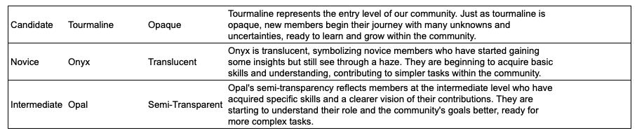

# WEB3DEV Fellowship

As you may know, we are using the [Polkadot Fellowship Program](https://github.com/polkadot-fellows/manifesto/blob/main/manifesto.pdf) written by [Gavin Wood](https://polkadot.network/gavin-wood/) as the base to create the WEB3DEV Fellowship.

## Objective

Our objective is to have a clear structure to help you live sustainably from Web3 with as much financial freedom as possible. We aim to achieve this in an organized way, with a clear and transparent structure.

Everything we do, including Kanban boards, processes, and payments, is open source and publicly available, as it should be in most DAOs.

Each "Level/Role/Position" has its own requirements, contexts, and associated scarcity.

We use a similar structure to Polkadot, associating each role with a specific trait of a crystal. Instead of picking hardness, we use clarity.

## Example of the First Three Levels

